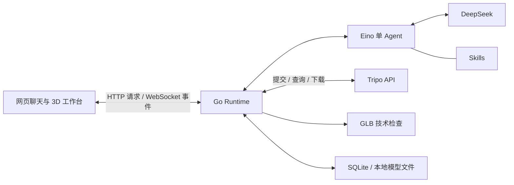

# Tripo Agent

面向 3D 创作者及行业从业者的资产创作 Agent。用户通过网页描述制作目标，由单个 Agent 理解需求、规划步骤、调用 Tripo API，并根据产物的技术检查结果调整后续动作，交付模型与结果说明。

项目关注的是 **Agent 如何完成一项可追踪、可验证、可继续创作的资产制作任务**。当前已实现文本生成静态模型、同会话版本减面与技术结果解释；长期逐步扩展到更多资产处理、骨骼绑定和动画能力。

## 当前能力

- **对话式创作**：支持匿名多会话。Agent 可针对关键需求进行最多三轮澄清；同一会话围绕一个资产主题，顺序完成多个制作目标。
- **生成与加工**：通过 Tripo 从文本生成静态 GLB 模型，也可根据新目标重新生成，或明确引用本会话的一个历史版本进行减面。
- **资产版本**：生成和加工结果保留为独立版本，记录来源与父版本，旧模型和技术报告不会被新结果覆盖。不能引用其他会话的资产。
- **技术检查**：检查 GLB 文件有效性、三角面数和文件大小。面数与文件大小上限由用户选择是否设置；未设置时仍提供实测数据，不做视觉质量评判。
- **网页工作台**：聊天、思考与执行状态反馈、实时进度、3D 预览、GLB 下载，以及执行记录导出。
- **持续执行与追踪**：不同会话可并发运行；保存执行状态、事件与检查点，支持断线重连和服务重启后的恢复。已知远端任务继续查询，提交结果未知时停止，不自动重复提交。

例如，先提出“制作一个用于产品展示的低模木箱”，生成后明确引用该版本，再提出“将面数减半”或询问模型的技术数据。每个新目标有独立的执行记录，纯解释不会触发资产生产。

图片输入、用户模型导入、骨骼绑定和动画**尚未接入**。资产生产与加工长期以 Tripo API 为唯一来源，具体能力须完成接入与验证后才向用户提供。

## Agent 如何工作

一次制作目标的主要过程是：

1. **理解目标**：整理用途、风格与可选技术约束，必要时向用户澄清。
2. **规划并执行**：结合会话上下文和已引用版本，选择生成、减面或直接回答。
3. **检查与调整**：跟踪 Tripo 异步任务，下载真实产物并生成技术报告；Agent 据此决定交付、继续减面、重新生成或停止。
4. **解释与交付**：说明实际完成了什么、检查结果和剩余限制，提供模型与可追溯的执行记录。

**Agent 负责选择，Runtime 负责可靠执行。** Eino 管理模型与工具调用循环；Skills 提供意图理解、生成、加工和纠偏指引。Go Runtime 负责会话隔离、预算约束、排队调度、任务轮询、文件检查及状态恢复。模型提议、实际工具执行与检查结果分别记录，结果说明必须有执行证据支持。

## 系统架构

**Go · CloudWeGo Eino ADK · DeepSeek V4 Pro · Tripo API · SQLite · 原生 HTML/CSS/JavaScript + model-viewer**



- **会话与上下文**：一个会话承载多个顺序执行的目标（Run）。每个 Run 有独立预算、检查点和结局，资产版本连接前后目标。
- **执行与恢复**：SQLite 保存会话、版本元数据、事件和 Eino 检查点，本地目录保存模型文件；WebSocket 推送进度并支持事件补读。用户主动停止的目标不支持恢复，也不保证远端任务取消。
- **部署结构**：单个 Go 服务同时提供 API、WebSocket 和静态网页。前端资源嵌入可执行文件，运行时不需要 Node.js；同一数据目录由一个服务进程管理。

主要代码位于 [internal/app](internal/app/)（Agent 与应用运行时）、[internal/tripo](internal/tripo/)（供应商适配）、[internal/asset](internal/asset/)（技术检查）和 [internal/web](internal/web/)（网页工作台）。

## 本地运行

准备 Go 1.26.1 或兼容更新版本，以及 Node.js 与 npm（建议 Node.js 22，用于构建前端资源）。在仓库根目录执行：

```sh
npm ci --ignore-scripts
npm run build
```

首次运行，将 [.env.example](.env.example) 复制为 `.env`，填入 `DEEPSEEK_API_KEY` 和 **Tripo 国内站**的 `TRIPO_API_KEY`。默认使用 `https://openapi.tripo3d.com/v3`。已有 `.env` 时保留原配置，密钥不要提交到 Git。

```sh
go run ./cmd/server
```

打开 [http://127.0.0.1:8080](http://127.0.0.1:8080)，即可发送制作请求。服务默认读取当前目录的 `.env`，将数据保存在 `./data`；重启时沿用该目录。监听地址等配置见 [.env.example](.env.example)。

## 开发与验证

本地回归测试：

```sh
go test ./...
```

默认测试不调用真实供应商。验证分为系统回归、Agent 决策评测和真实 Tripo 链路：分别检查执行机制、意图与策略及结果解释、实际生成与加工是否成立。接口调用成功不等于 Agent 决策正确。

已有 [Agent 评测报告](docs/evaluations/2026-09-17-optional-v4-evaluation-results.md)和[真实生成与减面记录](docs/verification/optional-asset-limits/tripo-live.md)，详细结果与已知限制保留在各自报告中。

## 项目文档

| 文档 | 内容 |
| --- | --- |
| [PROJECT_BRIEF.md](PROJECT_BRIEF.md) · [CONTEXT.md](CONTEXT.md) | 产品定位、阶段目标、能力边界与运行约束 |
| [架构决策](docs/adr/) | 关键设计及其取舍 |
| [现行规格](openspec/specs/) | 各项能力的行为要求与验收场景 |
| [国内站接入与诊断](docs/tripo-china-deployment.md) | Tripo 配置、鉴权预检与错误排查 |
| [升级与备份](docs/conversation-upgrade.md) | 数据兼容、备份和回退步骤 |
