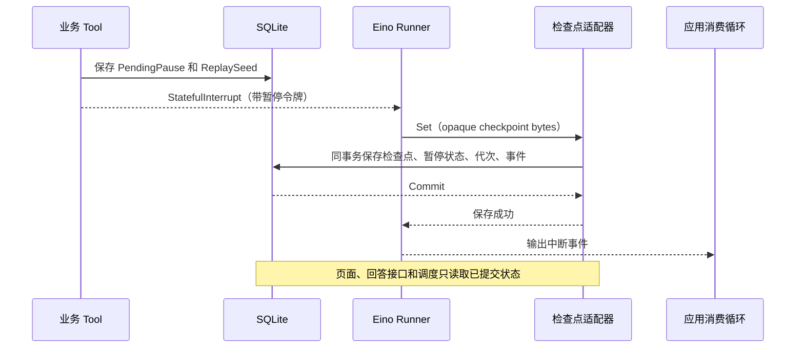

## Context

动机与范围见 [proposal.md](proposal.md)，行为契约见 [checkpoint-recovery/spec.md](specs/checkpoint-recovery/spec.md)。本设计依据 `mvp` 分支提交 `b91ab83`；以下代码事实描述修复前的规划基线。实现及恢复专项验证已完成，本变更于 2026-09-13 归档，最终实现与验证边界见文末 Implementation Notes。

| 现有实现 | 与本次修复相关的事实 |
| --- | --- |
| `internal/app/agent.go`：`ask_user`、`prepareProduction` | 先改业务状态，再返回 `StatefulInterrupt`；恢复时答案被清空；生产结果只在当前操作身份匹配时可重用 |
| `internal/app/service.go`：`run`、`Answer`、`schedule` | 消费中断后再写 `CheckpointReady=true`；没有检查点代次；回答和排队依赖该标记 |
| `internal/app/store.go` | `Store.Edit` 原子保存会话与事件，`checkpointStore.Set` 单独保存检查点；SQLite 为单连接 |
| `internal/app/service_test.go` | 现有重启测试等待 `CheckpointReady` 或任务 ID 成立后才关闭服务，没有覆盖中间写入间隙 |
| 锁定依赖 Eino v0.9.19 | `adk/runner.go` 在发送中断事件前调用检查点存储；保存失败还可能继续发出中断事件，应用不能单凭该事件宣布提交成功 |
| Eino 的 `adk/interrupt.go` | `CheckPointStore.Set(ctx, key, bytes)` 是外层保存适配点；检查点是 Eino 的 opaque gob 数据；`Runner.Resume` 后仍使用传入的同一个 checkpoint key 保存新检查点 |
| Eino 的 `compose/tool_node.go` | 公开 `GetToolCallID(ctx)`，可关联已接受的模型提议与工具执行，不需要修改框架私有状态 |

本项目继续采用一个 Go 进程管理同一 SQLite 数据目录。预算、停止、队列、匿名归属、数据保留及产物技术检查沿用已有 ADR；不以本次修复引入新的生产能力。

## Goals / Non-Goals

**Goals:**

- 将恢复定义为对持久化事实的校验与推进，确保页面可见暂停对应可使用的恢复点。
- 覆盖首次检查点之前的退出，以及旧检查点仍存在时准备下一暂停的退出。
- 让同一个已接受答案、同一个已完成生产操作可以被安全重放，并保持业务计数与报告一致。
- 在检查点写入、用户回答、停止、到期与调度并发时，保留较新的业务事实。
- 使用受控依赖和强制进程退出提供可重复的验证证据。

**Non-Goals:**

- 不承诺远端副作用 exactly-once，也不把数据库事务跨越模型请求、Tripo 请求或文件写入。
- 不实现任意 Agent 步骤的通用日志重放引擎、全量模型响应缓存或 Event Sourcing。
- 不重构 Session/Run/Asset，不引入多实例租约，不做另四项架构扩展。
- 不改变回答 HTTP 请求结构；本次保证服务端已接受答案的恢复，不增加浏览器命令幂等键或解决所有过期页面提交问题。
- 不保证未持久化的模型响应可以找回；真实模型调用的失败或必要重试仍计入原额度。

## Decisions

### 1. 用暂停身份和检查点代次表达恢复关系

保留 `Session` 为一次请求的持久化容器，增加有限的恢复字段。以下名称表示设计职责，具体字段布局可以在实现时保持项目现有编码风格：

| 数据 | 内容及职责 |
| --- | --- |
| `RecoverySchemaVersion` | 区分旧记录与新恢复协议，支持幂等迁移 |
| `ResumePoint` | 当前已提交恢复点：会话 ID、`pause_id`、`generation`、暂停类型、`wait_id` 或 `operation_id`、checkpoint key 和摘要 |
| `PendingPause` | 一个尚未生效的暂停草案：预期前代次、下一代次、已验证的问题或生产参数、稳定身份与重建依据 |
| `ReplaySeed` | 仅绑定该草案的模型输入消息、完整已接受助手响应、服务端决策 ID、工具调用 ID、参数摘要和模型/Prompt 配置标识 |
| `Answers` | 按 `wait_id` 保存已接受的答案及接受时间；不在工具第一次读取时删除 |

`pause_id` 标识一个逻辑等待或生产暂停，`generation` 标识检查点的某次提交。重复确认同一提交不产生新代次；同一逻辑暂停确需重新建立检查点时，可以产生新代次，但不能再次扣澄清额度或入队。

工具调用 ID 只用于关联，不假定供应商永远不重复它。新的模型决定使用服务端决策 ID 区分；同一决定的重建沿用原 ID。参数不同或决定不同的调用不得被误认为重放。

检查点表保留 Eino 原始字节，为同一根 key 增加应用侧代次、暂停身份、摘要及协议版本。会话中的 `ResumePoint` 与该行元数据在同事务更新。Eino key 继续使用现有会话 key，避免误以为 `Runner.Resume` 会自动切换保存 key；版本由适配层管理。

`CheckpointReady` 仅作为旧记录兼容输入，不再成为回答、调度或恢复的依据。`Current` 继续代表已提交的当前生产操作；准备下一操作时先写入 `PendingPause`，不能提前覆盖 `Current`。

替代方案：只在启动时判断“有无检查点”或增加一个 Ready 标志，无法区分新旧暂停，不能满足身份一致要求。

### 2. 采用 prepare / commit 两个本地阶段，只有 commit 发布暂停

**Prepare：**工具完成现有约束校验后，持久化一个绑定已接受提议的 `PendingPause`。此时保存恢复所需的信息，但不发布新问题、不增加澄清次数、不作为已入队记录，也不调用 Tripo。已存在的生产名额与已完成操作保留原值。

**Commit：**Eino 产生检查点字节后，由 `checkpointStore.Set` 调用一个小型暂停提交协调器，在同一 SQLite 事务中完成：

1. 读取最新会话，校验会话归属、执行实例、前代次、草案身份、终止状态和适用期限。
2. 保存 checkpoint 原始字节、摘要、代次与暂停绑定信息。
3. 将对应草案发布为 `ResumePoint`；发布问题并仅首次增加该问题的澄清次数，或发布生产操作及其队列/名额状态。
4. 保存对应业务事件与 `checkpoint_committed` 事件，清除已提交草案，提交事务。

事务使用当前数据合并必要字段，不能把 prepare 时复制的整个 Session 覆盖回去，否则会覆盖同时到达的停止、答案或预算事实。

工具闭包与检查点适配器共享一次 Runner 执行的协调对象，负责关联草案和预期代次。不能依赖 Tool 局部 context 值出现在 Runner 的保存回调中，也不能在 Eino 编码和网络等待期间持有数据库事务。沿用 `Service.mu → 数据库事务` 的锁顺序；单连接下禁止事务内再调用会打开另一个事务的 `Store.Edit`。

暂停令牌使用应用可识别的带版本 JSON 字符串，携带暂停身份和代次；继续利用 Eino 已支持的 string 中断状态，避免注册新的私有 gob 类型。工具恢复入口使用公开的 `GetInterruptState` 校验该令牌，适配层不解析或改写 Eino 私有 gob。

每个执行实例绑定预期前代次。相同代次、暂停身份和字节摘要的重复 `Set` 识别为已提交；不同内容或旧实例写入必须拒绝。`run()` 消费中断事件后只检查提交结果，不再通过另一次写入宣告 Ready，也不能把保存失败后出现的中断事件误当成功。

等待问题发布后，即使回答先于消费循环结束到达，也不会被消费循环中的旧快照覆盖。

替代方案：在工具内直接开启事务并等待 Eino 保存，会跨越框架执行边界，且可能在单连接数据库上死锁；先发布等待再补写检查点则保留原崩溃窗口。

### 3. 显式重建尚未提交的暂停

只合并 commit 事务仍不能解决“首次 prepare 后退出、尚无 checkpoint”的情况。因此，待提交草案必须有可重建依据，而不能只保存一个 `wait_id`。

恢复入口发现有效 `PendingPause` 时，优先完成该草案，不用旧检查点猜测新动作：

1. 校验草案、已接受助手响应中的唯一工具调用、参数摘要和原模型配置一致；校验执行限制。
2. 使用冻结的预调用消息构建一次专用恢复 Runner 输入。区分框架生成的系统前缀与已有协议消息，不重复拼接历史系统提示。
3. 一个仅服务于该草案的重放模型适配器，在这一次调用位置返回已保存的完整助手响应。它不访问 DeepSeek、不增加 `ModelCalls`，并保留工具调用 ID 与 `reasoning_content`。
4. 对应 Tool 识别同一草案，只重建 `StatefulInterrupt`；不得再次决定参数、增加计数、领取新的生产名额或执行 Tripo 提交。
5. Eino 正常编码并调用同一个原子 commit 路径。随后恢复正常的等待或生产调度。

重建期间若出现额外模型调用、不同工具调用或参数变化，立即拒绝并记录 `recovery_seed_invalid`；不退回真实模型猜测。重建再次中断时继续沿用同一草案，直至提交成功或按有界错误策略结束。

`ReplaySeed` 是暂停草案的有限恢复材料，完成提交后可以删除；它不是跨请求 Memory。框架仍负责重建和读取自身检查点，应用不手工构造其 gob 数据。

实现第一批集成测试应先证明锁定 Eino 版本上的“完整消息恢复 → 重放一个原提议 → 真实中断 → Set → Resume”路径及协议字段完整性。这是已选设计的适配验证，不是留待 apply 再决定恢复架构。

替代方案：从原用户文本重新启动会改变已经作出的决定并可能重复模型调用；直接把以助手 Tool Call 结尾的 History 发给真实模型会产生未闭合的工具协议；简单回到旧 checkpoint 又不能保证采用已准备的新动作。

### 4. 保留可重放的业务结果，限制改动面

**用户答案：**`Answer` 在同一事务中校验当前已提交问题、绑定 `wait_id` 保存答案并设置可继续执行状态。工具恢复时读取该记录，返回原答案；可以清除页面当前问题的展示字段，但不能删除答案证据。答案最多按当前澄清上限保存，随原会话保留期清理，不扩展跨请求记忆。

**生产结果：**继续使用当前操作的 `operation_id`、`task_id`、错误和 Artifact 报告。因为 `Current` 只会在新检查点原子提交时替换，旧恢复点仍可能被使用期间，其完成结果必须保留。新检查点提交后，旧代次已被拒绝；无需为了此修复建立通用操作历史库或资产版本系统。

- `ready`：先保存扣减和 `submitting`，再提交供应商，沿用既有边界。
- `submitting` 且没有持久任务 ID：停止自动执行，保留额度；不能因重建重发。
- `submitted`：继续查询原任务，不重新提交。
- `done`：返回已保存的结果，不能再次追加同一 Artifact 或技术报告完成事件。

文件已经写入但产物事务未提交时，可以在原操作路径上重新下载/检查并完成保存；产物记录以原操作身份去重，不能重新创建生产。文件写入仍不属于 SQLite 事务。

重放返回相同的业务证据，剩余次数等动态字段重新读取持久预算，避免旧工具结果中的余额覆盖新的事实。真实后续模型调用继续计数；只有返回缓存提议或缓存结果的本地重建不算新模型调用。

纯检查点重放不能重新执行不相关工具。若在无新草案的正常续跑中确需再次调用 `set_intent`，相同已确认意图可返回原结果，不得放宽或覆盖原约束；该处理仅用于恢复重入，不能变成重新定义意图的入口。

替代方案：第一次读取后清空答案，把正确性寄托在“不会再次恢复这个检查点”，与框架真实重放行为不符；为所有工具建立通用幂等平台则超出当前修复需求。

### 5. 恢复先于正常调度，按持久状态决定动作

启动时及恢复错误后的重试入口执行同一套对账。新请求处理和正常生产认领必须等待初始对账完成；单个会话的协议错误被隔离，不能阻塞其他会话。

| 优先级 | 条件 | 处理 |
| --- | --- | --- |
| 1 | 已终止、生产超时或适用空闲期限已到 | 保持终止或按既定规则结束，后续检查点不能复活请求 |
| 2 | 提交结果未知 | 保留操作与额度，结束自动执行，不重新提交 |
| 3 | 有未终止的已知远端任务 | 保留名额与原任务身份；检查点可用时正常恢复，不可用时先走确定性查询与技术检查，不依赖模型额度 |
| 4 | 有完整、匹配的 `PendingPause` | 重建同一个草案，不使用旧 checkpoint 推进新动作；若优先级 3 存在，先核对原任务状态，不能因此丢弃合法草案 |
| 5 | 有匹配的已提交恢复点 | 未回答则等待，已回答则恢复；排队按持久票据调度，`queue_full` 仍等待用户重试；已完成操作返回已有结果 |
| 6 | 旧协议记录 | 按迁移表处理，不能只看旧 Ready 标志 |
| 7 | 无恢复记录的正常新请求 | 使用现有初始执行入口；发现不完整旧协议消息时按不可安全恢复处理，不把悬空 Tool Call 发给真实模型 |

恢复结果必须在执行前再次核对，因为用户停止和期限到达可能发生在对账之后。读取 Eino 检查点只能恢复框架消息与控制状态，预算、终止、排队顺序等业务事实始终取自最新数据库。

生产队列只在暂停 commit 中首次接受；已有队列时间与名额恢复时不重置。首次提交前的 pending 草案不占新名额；已有生产请求准备纠偏时继续保留原名额。提交协调与调度沿用同一个进程内互斥与事务顺序，避免并发超分配。

数据库写入错误使用现有有界退避重试，始终针对同一草案和预期代次。重试耗尽且数据库可写时，记录 `checkpoint_write_failed` 并明确结束该请求；数据库仍不可用时停止该 worker 并报告服务存储错误，不在 150ms 调度循环中无界重试，存储恢复后的启动/恢复入口再对账。不能通过反复重启重置请求本身的预算或期限。

### 6. 保持旧记录的恢复边界，无法证明时明确降级

旧记录没有检查点代次，不能直接补上 `generation=1` 就假定它匹配当前业务状态。使用兼容模式隔离一次旧恢复：模型调用和远端提交暂时禁止；Eino 解码原检查点后，工具入口通过公开中断状态获得旧 `wait_id` 或 `operation_id`，与已保存状态校验。验证匹配后，立即重新中断并通过新协议保存恢复点，再允许正常继续。

旧答案还在 `Session.Answer` 时直接绑定原 `wait_id`；答案只存在于 History 时，仅在问题、工具调用关联和结果顺序可唯一验证时提取。若答案确实丢失或关联不唯一，则不能猜测。`CheckpointReady=false` 不影响对真实已保存 checkpoint 的校验。

| 旧记录情况 | 迁移行为 |
| --- | --- |
| 已终止记录 | 原样保留归属、结果、预算与到期时间，不恢复，不删除模型 |
| 等待点与 checkpoint 可验证匹配 | 兼容模式重建带身份的恢复点，不重复提问、扣次数或入队 |
| checkpoint 缺失，但有完整、唯一的已接受暂停提议和安全重建材料 | 构造待提交草案，经同一受限重建路径恢复；无法验证则不能采用此分支 |
| checkpoint 与当前等待/操作不匹配，或答案已经丢失且不能唯一恢复 | 沿用现有 `failed` 状态，记录 `legacy_recovery_unavailable`，保留所有证据，不自动生成新请求 |
| 已知远端任务、Agent checkpoint 不可用 | 沿用原 `Current` 继续确定性查询、下载和检查；按真实报告提供程序交付或停止说明，不执行新的模型决策与纠偏 |
| 未知提交 | 保持停止、不重发、已扣额度不退回 |

只有不具备可证明恢复材料的旧坏记录才会明确失败；新协议下有效 pending 草案不能以“没有 checkpoint”为由直接失败。已知任务分支不把 Agent 恢复失败误认为远端任务失败，也不绕过产物检查。

### 7. 恢复事件与验证证据

新增最少的业务事件：`checkpoint_committed`、`checkpoint_rebuilt`、`recovery_rejected`，兼容迁移在数据中标明来源。事件携带会话内暂停 ID、代次、适用的操作 ID 与原因码；仍使用现有脱敏和访问归属校验。待提交草案、原始 checkpoint、完整协议消息不加入 `Session.View()` 或事件导出。

逻辑问题、入队、生产提交、产物保存等事实事件只记录一次；恢复过程可以有独立审计事件，不能把重放标成新的模型提议或新的生产成功。

验证矩阵：

| ID | 故障/竞态位置 | 关键断言 |
| --- | --- | --- |
| F01 | 首次 prepare 已提交、Eino Set 前强制退出 | 同一个问题恢复可回答，重建没有新增模型调用 |
| F02 | Set 事务内写了 checkpoint、业务提交前退出或报错 | 整个新提交回滚，旧点与 pending 保留，没有半个等待状态 |
| F03 | Set commit 后、消费中断通知前退出 | 直接识别已提交点，计数和事件不重复 |
| F04 | 第二、第三轮新 prepare 后退出；注入旧实例 Set | 不串用旧问题或旧代次，旧写入被拒绝 |
| F05 | 答案接受后，以及 Tool 返回答案后、下一暂停前退出 | 对应答案可重复读，澄清计数不变，DeepSeek 协议字段保留 |
| F06 | 排队暂停前后、领取名额前后退出 | 已接受队列顺序不变，名额不重复，排队不启动生产计时 |
| F07 | `queue_full` 请求重启后再重试 | 保留原操作，不自动入队，不重复创建草案 |
| F08 | 保存 `submitting` 后，以及远端接收后但 task ID 未保存时退出 | 不重发；远端提交次数最多一次，额度保留 |
| F09 | task ID 保存后退出，包含模型额度耗尽 | 继续原任务查询与检查，截止时间及提交次数不变 |
| F10 | 文件写入后/产物记录保存后、Tool 返回前后退出 | 同一产物记录及报告完成事件不重复，实际报告一致 |
| F11 | Set、恢复或领取名额与停止/到期并发 | 终止优先，不复活，不新增生产，保留期限不重置 |
| F12 | 旧记录：Ready 缺失、旧字符串状态、丢失答案、已知任务缺 checkpoint | 分别验证兼容恢复、明确失败、确定性续查，不静默卡住 |
| F13 | 跨会话 checkpoint 混用、字节损坏、草案参数不匹配 | 提交前拒绝并隔离；其他会话可继续 |
| F14 | 重复 Set 确认、重复重建、迁移中退出后重复启动 | 同一逻辑暂停、答案、操作的效果不重复 |
| F15 | 原提议的 `reasoning_content` 在恢复时丢失、悬空 Tool Call 或不兼容重建输入 | 必需协议字段丢失时明确拒绝；正常受限重建后可真实 Runner.Resume，不强制无此字段的模型模式补造内容 |

使用现有受控模型/Provider 扩展测试。事务回滚与竞态可采用单元测试；关键退出点采用 `_test.go` 中的子进程辅助入口和屏障，直接终止进程，不调用 `Service.Close()` 代替崩溃。父进程中的假 Provider 保留提交计数与任务状态，子进程共享临时 SQLite/模型目录，从而检验退出前后的实际副作用总数。

不新增正式服务的故障注入开关，不使用真实密钥或付费 API。专项测试通过后执行现有 `go test -race ./... -count=1` 与 `go vet ./...`；新证据写入恢复验证记录，保留 Agent 案例集尚未完成的独立状态。

## Risks / Trade-offs

- [恢复适配仍依赖 Eino 的中断/消息协议] → 使用已锁定 v0.9.19、公开 API 和真实 Runner 集成测试；不复制私有 gob 类型，不在此变更升级框架。
- [prepare 增加少量持久化数据和一次本地写入] → 每会话仅一个 pending 草案，提交后删除重建材料，答案受现有澄清上限和会话保留期约束。
- [两阶段设计仍有 prepare 与 commit 间的退出点] → 该间隙由受限重建显式覆盖，不能只测试 commit 原子性。
- [单连接事务、Service.mu 与回调易形成锁顺序问题] → 固定互斥到事务的顺序；事务内复用同一连接；不等待模型、框架编码或网络调用。
- [旧数据可能已不可逆丢失答案或身份关系] → 仅对可证明的数据迁移；坏记录明确失败，已知任务独立续查；不以伪造恢复换取表面成功。
- [远端接受请求与本地 task ID 持久化无法原子化] → 保留未知提交不自动重发策略，允许少量无法自动继续的请求，不承诺 exactly-once。
- [更多受控回归不等于全部 Agent 能力通过] → 独立报告恢复场景；不改写真实演示与固定案例集的验收状态。

## Migration Plan

1. 在迁移测试中使用旧基线生成的临时数据库和真实 Eino checkpoint，先验证兼容矩阵；不对开发者当前 `data/` 做规划阶段试迁移。
2. 正式实施采用增量 schema 迁移，为检查点增加可空的版本/身份/摘要字段；会话 JSON 新字段兼容旧记录。迁移可重复运行，新记录直接写新协议。
3. 部署前停止旧服务接纳请求并备份数据库和模型目录；新版本初始化时先迁移 schema、执行会话恢复对账，再开放正常调度和请求接纳。
4. 旧记录按决策 6 分别迁移；坏记录只改变可解释的恢复结果，不删除原证据。新增恢复字段和答案随原会话删除规则清理。
5. 回退边界：只有新版本仍处于迁移阶段、尚未开放正常调度且未接受新用户操作时，才可恢复迁移前备份并回退旧程序。一旦原请求或新请求推进了模型调用、答案、队列或生产状态，禁止直接恢复旧快照导致任务 ID、额度或用户输入丢失；应保留新数据，停止新增执行并以前滚修复处理，不自动降级恢复协议。
6. 实现完成后补充恢复协议 ADR 和运行验证记录；不改写既有预算、未知提交和产物验收规则，不自动归档 `first-asset-demo`。

## Implementation Notes

实现将恢复职责放在 `recovery_types.go`、`recovery_store.go`、`recovery.go`、`recovery_seed.go` 和 `recovery_startup.go`，确定性生产步骤从原服务文件移到 `production.go`。SQLite 使用一个可空 `metadata` 列保存版本、身份、代次和摘要；既有 Eino 字节原样保留。服务启动对账失败会返回错误，入口在成功前不开放 HTTP 接纳和正常调度。

兼容迁移中的 `Existing` 草案如果没有独立 Seed，仍依赖原检查点可用。该依赖经验证损坏时，保留草案证据并按已知任务的确定性恢复分支处理，不能把“草案字段齐全”误认为“能够独立重建”。新的完整 Seed 草案继续优先重建。

最终技术决策见 [ADR 0019](../../../../docs/adr/0019-atomic-checkpoint-pause-recovery.md)，故障矩阵、回归结果与部署边界见 [恢复专项验证记录](../../../../docs/checkpoint-recovery-verification.md)。
