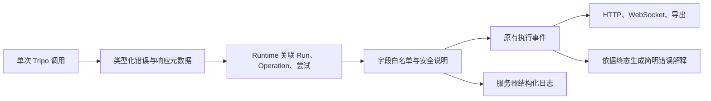

## Context

动机及确认范围见 [proposal.md](proposal.md)。设计基于提交 `85164c6` 的现有实现；本文件描述待实施方案，不是上线记录。

| 当前事实 | 设计影响 |
| --- | --- |
| `internal/tripo/client.go` 已调用 V3，基址固定为国际站；生成为 H3.1，减面为 `v2.0` | 修改接入配置，不做模型或 API 协议迁移 |
| `ConfigFromEnv` 读取 Key，但没有 Tripo 基址；服务就绪判断仅检查 Key 非空 | 补配置传递与显式只读预检，不能依靠原就绪标识证明鉴权 |
| 客户端 `APIError` 只有 HTTP 状态、供应商码和 Unknown；网络／读取错误、响应追踪信息被丢弃，执行层再次归并成普通字符串 | 在信息首次出现的位置保留结构化事实，并贯通 Runtime 和输出 |
| 提交前持久化 `submitting` 与扣额，返回 TaskID 后单独保存；未知提交不重发，已知任务继续查询 | 沿用现有一致性协议，附加诊断不能改变顺序 |
| 查询／下载已有最多三次的局部重试，上传准备已有持久化尝试预算 | 在各次尝试边界记录错误，不把生产动作套进统一重试器 |
| 现有事件、HTTP、WebSocket 快照和导出已承载执行证据 | 增加兼容事件载荷和页面说明，无需新通信协议或日志数据库 |
| 当前错误脱敏主要替换已知 Key，URL 清理不能覆盖句子里的签名链接 | 采用字段白名单和安全文案，不能直接持久化或打印原始异常 |

此前 ECS 排查观察到国际站连接失败、国内接口返回 401；这能证明当时国内网络可到达，不能证明国内凭证或完整生产链路可用。用户已表示更换国内 Key，实际配置和鉴权须在实施时重新验证。本文不把历史网络快照当作当前运行状态。

相关约束来自 ADR 0009（已知任务恢复）、0010（本地数据）、0017（证据）、0019（checkpoint 一致性）、0022（连续会话）、0023（可选验收约束）。`make-asset-limits-optional` 已实现但未归档；本次不覆盖其 delta。现行 `checkpoint-recovery` 中“旧记录兼容恢复”仍适用于正常升级；用户授权的一次性数据重置属于明确的发布例外，不改写普遍规则。

## Goals / Non-Goals

**Goals:**

- 用同一套配置贯通国内站提交、查询、上传及部署预检，并在真实 ECS 上完成交付验收。
- 将“观察到什么错误”和“允许采取什么动作”分开，错误诊断不得授予生产重试权限。
- 在现有执行事件和日志中形成足够定位问题的安全证据，保持 HTTP、WebSocket、导出和终态说明一致。

**Non-Goals:**

- 不增加 Agent 工具、Skill 版本、执行协议版本或额外生产决策；不在本次替换 Tripo SDK。
- 不引入双站点任务存储、区域路由、密钥指纹迁移、远端幂等平台或后台未知任务找回服务。
- 不把所有历史异常文本重写为新格式，不建设通用日志搜索、告警平台或全量成功请求采样系统。

## Decisions

### 1. 配置一个官方 V3 基址，部署固定使用国内站

在应用配置中增加 `TripoBaseURL`，环境变量为 `TRIPO_BASE_URL`，缺省为 `https://openapi.tripo3d.com/v3`。服务启动时规范化尾部斜杠并验证：HTTPS、官方主机 `openapi.tripo3d.com` 或 `openapi.tripo3d.ai`、路径严格为 `/v3`、无用户信息／查询／片段，仅默认 HTTPS 端口。拒绝任意代理地址或非官方主机，避免错误配置将 Key 发送到无关服务。

配置只有一个生效值；保留两个官方地址作为显式配置的合法值不意味着同时使用两个站点。此次 ECS 和示例配置均明确国内站，失败不回退国际站，Agent、用户消息及会话均不能修改站点。带旧任务热切站或切换不兼容账户不受支持；必须停服并按明确数据处理方案切换，不能靠重启后的试错查询兼容。

由应用配置把规范化基址传给 `internal/tripo`，提交、查询、`UploadModel` 和只读预检共享配置。测试通过显式注入客户端／Transport 或测试服务替身隔离网络，不开放生产环境的任意地址逃生开关。保留现有 API 请求时限与单独的下载客户端；下载依然校验 HTTPS、全部解析地址及重定向，不附加 API Key，不重写供应商 CDN 地址。

端点与模型保持：

| 操作 | 国内接口 | 模型／算法 |
| --- | --- | --- |
| 文本生成 | `/v3/generation/text-to-model` | `v3.1-20260211` |
| 上传已有版本供加工 | `/v3/files` | 不适用 |
| 减面 | `/v3/mesh/decimate` | `v2.0` |
| 查询 | `/v3/tasks/{task_id}` | 沿用原任务 |
| 只读预检 | `/v3/account/balance` | 不适用 |

国内／国际地址见 [Tripo 官方 Go SDK](https://github.com/VAST-AI-Research/tripo-go-sdk)；H3.1 标识见 [模型文档](https://developers.tripo3d.ai/en/models/v3-1)，V3 减面使用 `v2.0` 见 [减面接口文档](https://developers.tripo3d.ai/zh/docs/mesh-decimate)。这些版本属于不同层级，不应按一个数字统一替换。

取舍：单改 ECS DNS、加代理或延长超时不能解决站点与凭证匹配，且增加运维依赖；直接替换整套 SDK 会引入不必要的协议和自动重试变化。保留现有适配层并打通配置，改动范围最小。

### 2. 用显式只读预检作为发布前置条件

增加最小预检入口，例如 `cmd/check-tripo`，复用服务的配置加载及 Tripo 适配层，以有限超时请求余额接口。预检不初始化生产 Run、不上传文件、不启动 Agent，也不在每次 `/health` 或用户请求时重复运行。返回明确成功／失败退出状态和脱敏结果：站点、Key 是否存在、错误类别、HTTP／供应商码、追踪标识及耗时；无必要输出账户余额明细，更不能输出 Key。

部署中从 systemd 服务实际使用的环境文件、服务用户和工作目录运行预检，处理进程环境优先于 `.env` 的规则。更新环境文件不等于旧进程已更新：启动后再次核对运行进程的非敏感配置，并在本机受控比较凭证是否一致，只输出布尔结论，不打印环境全文或凭证摘要。

预检 401 时，先修正国内账户／有效凭证和加载方式；连接失败时按诊断修复网络。两者都不创建真实生产任务。预检只证明这一时刻的余额接口访问和鉴权，不证明生成、上传、CDN 下载或账户额度一定满足生产，后者由真实验收验证。

取舍：将联网预检做成所有启动的强制动作会使短暂的外部故障影响正常恢复；因此使用显式发布门槛，而非新建持久在线健康依赖。

### 3. 结构化错误保留证据，公开内容只取安全字段

扩充现有 Tripo 类型化错误，保留 `IsUnknown` 可识别性，使用 `errors.As`／`errors.Is` 检查被包装的底层错误。底层 cause 只在进程内用于分类，安全 `Error()` 不串联原始 cause；原始 request、headers、body 和异常对象不进入事件或通用 `slog` 字段。

失败载荷建议如下（名称可在实现时按现有代码风格调整，含义固定）：

| 字段 | 含义与边界 |
| --- | --- |
| `schema_version`、`provider` | 诊断载荷版本与 `tripo`，与 Skill／执行协议版本无关 |
| `phase`、`request_started` | `submit`／`query`／`upload`／`download`；仅表示是否进入客户端网络调用，本地准备失败为否，不表示远端已经接收 |
| `category` | `dns`、`connect`、`tls`、`timeout`、`canceled`、`http`、`provider`、`task_failed`、`decode`、`protocol`、`local_validation`、`unknown` |
| `cause_code` | 可选的安全原因标识，例如连接重置、连接拒绝或 DNS 无记录；只从类型化底层错误映射，不保存任意原始错误文本 |
| `occurred_at`、`duration_ms` | 实际发生时间和单次调用耗时；下载包含读取阶段，不虚构更细网络耗时 |
| `attempt_id`、`retry_group_id`、`attempt` | 每次尝试唯一身份、所属重试组和组内序号；恢复时新组保持原 Run／Operation 关联，序号不伪装为全局累计值 |
| `run_id`、`operation_id`、`task_id` | Runtime 已知身份；无任务身份时为空，不以 operation ID 冒充 TaskID |
| `http_status`、`provider_code`、`task_error_code`、`provider_trace_id` | 可选，区分 HTTP／信封错误与异步任务错误；未取得时缺省，不用 `0` 表示收到过状态 |
| `submission_unknown`、`message` | 现有提交未知判定与安全短句；不得由前端或 Agent 根据错误类别重算重试权限 |

响应处理先保留 HTTP 状态和允许的追踪头，再做有界正文读取与协议解析，避免非 JSON 错误响应把状态丢失。供应商成功响应缺 TaskID、5xx 或不完整响应保留未知提交判定。查询返回 `status=failed` 时单独记录任务错误码，不能因 HTTP 200 抹掉远端任务失败，也不能标成查询网络错误。

默认 `message` 使用分类对应的固定中文描述，加允许的状态／错误码。只有明确可安全保留的供应商描述片段才进入证据；无法可靠清理的片段舍弃，代码和追踪标识仍足以关联。沿用 API 正文读取上限，外部追踪标识限制为 128 字符、安全说明限制为 512 字符；拒绝控制字符及不合规标识，禁止整段原始正文入库。所有公开投影和服务器日志复用同一允许字段集合，补测句中 URL、Authorization、token 和嵌套对象泄露。

取舍：只保存格式化字符串会再次丢失错误类别与上下文；完整存储原始响应则增加泄露和体积风险。小型结构化载荷能够兼顾关联诊断、稳定显示和隐私边界。

### 4. Runtime 在现有事件链路记录每次失败

Tripo 适配层只返回本次调用事实，不直接修改 Run。Runtime 在提交、每次查询／下载重试、上传准备重试以及本地输入准备失败的边界补充执行身份，将安全载荷写为所属 Run 的 `provider_call_failed` 事件，并向 `slog` 输出相同关联字段。

保留已有进度和成功事件，不逐次复制成功查询响应。错误事件携带独立 `attempt_id`，同一错误不因外层包装、收尾或重连重复落盘；`runtime_finished` 只引用相关诊断或其安全摘要，不再创造第二次请求尝试。每个调用组分配 `retry_group_id`，组内重试带序号；这不要求新增全局计数表，也不影响上传准备已有的持久化重试预算。

本次不新增独立诊断表、消息队列或后台日志任务。已有 JSON 事件载荷支持新增事件，旧记录无该事件仍可读取；会话归属、保留期限、事件顺序和重连游标继续由现有实现负责。不得把诊断原文重新注入 Agent 上下文作为可信指令。

取舍：仅在执行最终失败时记录会遗漏重试后成功的故障；在客户端中直接写数据库会混淆工具执行与 Runtime 职责，并危及 TaskID 保存顺序。记录放在各次调用的 Runtime 边界。

### 5. 记录失败不得改变生产状态和请求次数

保持以下顺序和恢复结论：

| 边界 | 必须保留的结果 |
| --- | --- |
| 持久化提交意图／扣额失败 | 不向供应商提交；记录本地失败 |
| `submitting` 已落盘，随后提交结果未知 | 保留额度和状态，再尝试记录诊断；任何重放都不再提交 |
| 返回有效 TaskID | 优先按现有独立保存路径持久化身份，再写附加诊断；不能让日志失败阻挡身份保存 |
| TaskID 保存成功、附加事件失败 | 保留可恢复任务，不退回未提交，也不撤销额度 |
| TaskID 保存本身失败 | 记录可用的安全关联日志并停止；不宣称身份已持久化、不重新生产；恢复仍按数据库可证明状态处理 |
| 用户停止后返回 TaskID | 仍保存迟到任务身份，保持停止终态，不假称远端已取消 |
| 查询／下载／上传诊断写入失败 | 不将记录错误交给网络重试器，不额外调用供应商 |

提交 API 客户端禁止自动跟随重定向，3xx 保留状态并按无身份未知提交处理；上传和查询也不转送带凭证的重定向请求。文件下载继续使用独立且受校验的重定向策略。

生产请求不安装自动重试中间件、不设置幂等重试标记，提交请求体不提供用于重放的 `GetBody`。协议测试需覆盖连接复用失败和重定向，统计真实接收的生产 POST 次数，避免只检查顶层函数调用次数。查询／下载保留原最多三次局部尝试和原时限；上传继续受既有持久化准备次数限制，不能把它误算成生产提交，更不能在 `submitting` 后刷新 token 改参数重发。

存储可用时记录失败后再推进相应结束说明；存储不可用时，向仍可用的日志渠道记录安全的写入失败，并保留提交安全事实。数据库和日志同时故障、或进程在收到响应与记录之间退出时，不能保证完整诊断；没有新增 outbox 或分布式事务来假装消除这一窗口。安全下限是不重复提交，缺失信息如实标明。

取舍：根据 DNS／TLS 等分类推测“肯定未提交”并重试，会将诊断推断升级为收费生产权限；既有保守停止规则继续生效。明确拒绝的供应商错误仍走现有有限纠偏，不因本次改动扩大或取消其原预算。

### 6. 用户解释从终态与安全诊断共同生成

在现有结果构建路径中，依据当前操作、正式结果和关联诊断生成固定语义说明。例如提交超时且未知：

> 提交 Tripo 时超时。本次本地执行已停止；无法确认远端是否已经创建任务，系统没有自动重试。

文案中的阶段和错误必须由已保存事实支持；没有诊断时保留现有安全说明，不从约 30 秒耗时猜测 DNS、超时层级或网络运营方。HTTP 已成功而远端任务失败、远端已成功而下载失败、技术检查失败分别处理，不把网络错误改述成模型质量问题。

后端将同一安全摘要投影到读取、快照及导出；正式结果结构沿用当前版本，补充诊断属于兼容扩展，不修改 Agent 输出协议。最终成功优先于中间失败；最终停止不能被迟到诊断改成继续执行。网页只调整现有操作卡片、错误说明与证据区，不更改首页定位、正常生产步骤或宣传文案，不新增重提按钮。继续使用现有 HTTP 命令和 WebSocket 下行，诊断事件不具备触发命令的作用。

取舍：让 Agent 自由总结异常会重新引入无法核验的根因和处理承诺。Runtime 生成可验证说明，Agent 仍负责原有意图理解、计划和允许范围内的纠偏。

## Migration Plan

### 发布顺序

1. 完成代码、受控测试、相关回归和发布操作说明；构建可定位 revision 的候选包。记录当前服务、配置来源、实际数据目录、备份位置及是否有活动执行，不能把前次“一条失败且无 TaskID”的快照当作现在状态。
2. 准备国内基址与国内 Key，使用候选预检工具在 ECS 的目标服务环境中验证余额接口。预检失败时停止发布，保留旧运行数据，不进行付费生成。
3. 暂停入口并停止 `tripo-agent.service`，确认没有本项目后台写入。核实实际 `DATA_DIR`：拒绝根目录、仓库根目录、配置目录及其他项目；明确 SQLite 主库／WAL 等文件、checkpoint 和模型文件的实际归属，不能猜路径或仅删数据库留下孤儿资产。
4. 对停写后的完整运行数据做有权限限制的备份，验证可读取、目录内容及数据库完整性后，将旧运行数据移出活动目录并初始化空目录。备份不进入 Git；配置、Key、仓库评测证据和其他服务数据不在清理范围。国内网络或凭证问题不触发自动清理。
5. 安装候选版本，ECS 环境文件显式设置国内地址，启动服务；核对实际二进制 revision、国内基址和凭证加载一致性，再运行只读预检。验证旧会话／模型不可在新活动数据中访问，也没有启动旧任务查询。
6. 在受控访问窗口内执行下述真实验收，完成后恢复普通访问。记录脱敏证据、实际结果、未完成项；仅在证据满足时勾选相关任务。

### 回退边界

在国内新生产开始前，可停服恢复完整的旧版本、旧配置和对应备份，但原国际网络问题可能仍存在，回退不代表生产恢复。备份保留的目的也包括审计，不意味着应自动恢复旧国际任务。

一旦国内新任务已提交或普通用户开始访问，不能直接用旧国际数据库覆盖新数据，否则会丢失新 TaskID 并破坏防重提约束。此时先停写、备份当前国内数据，保留 TaskID 和未知提交状态，优先在国内配置下向前修复。必要的代码回退必须兼容当前国内数据且保留显式国内基址；不提供自动跨站数据回滚。

### 验证矩阵

| 层级 | 验证内容 | 通过依据 |
| --- | --- | --- |
| 配置／协议 | 国内缺省、显式配置、非法地址、所有 API 共用基址、只读预检、既有模型版本与可选约束 | 受控协议请求和配置断言，不访问真实生产 |
| 故障／恢复 | DNS／连接／TLS／超时、非 JSON、缺 TaskID、5xx、3xx、确定性拒绝、迟到 TaskID、诊断保存失败、进程退出恢复 | 错误分类与原状态正确；未知提交整个恢复过程只有一次生产 POST；已知任务沿用 TaskID |
| 重试／隐私 | 上传、查询、下载逐次失败，成功不被历史错误覆盖；存储、日志、HTTP、WebSocket、导出及匿名隔离 | 各次失败可关联、重试次数不扩大、敏感哨兵值不外泄 |
| 项目回归 | Go 测试、race、vet，现有网页行为测试及构建；涉及证据解析时补跑相应汇总脚本测试 | 相关测试通过，无需重跑完整真实模型案例集 |
| ECS 接入 | 真实服务配置下国内余额预检 | 网络、HTTP、业务鉴权通过，不能仅有 Key 非空 |
| ECS 真实链路 | 真实 DeepSeek 与 Tripo：一次文本生成，然后显式引用该会话 v1 完成一个减面目标，允许既有预算内依据技术报告自动纠偏 | 每次生产均有真实 TaskID；所有版本及未达标报告保留并可下载预览；各候选来源真实，最终交付实测面数下降且满足验收上限；事件、报告和正式结果一致 |

真实链路使用正常聊天入口和既有预算，不用 scripted model 替代 Agent。先生成一个明确的静态资产请求，尽量完整提供用途与风格以减少无关澄清；生成目标可为本次验收显式指定，但不改变产品缺省约束。v1 完成后读取实测面数，再给出低于输入且在供应商合法范围内的减面目标，明确引用本会话 v1。减面候选不达标时，允许 Agent 依据已保存的技术报告在原预算内有限纠偏，每次生产均计入原预算并保留任务及版本证据；发生未知提交时立即停止，不为了完成报告重提。确定失败或产物不达标的候选不能登记为通过，额外的人工重跑另行记录其原因和范围。

验收口径确认（2026-09-19）：原计划生成与减面各一次生产提交；实际 v2 为 1839 面，未满足 1500 面上限，Agent 自动纠偏后 v3 为 1473 面并通过。用户回复“接受”，确认按上述包含有限纠偏的链路验收。实际为一次生成加两次减面，共 3 次生产提交，未增加预算或人工新开 Run 重跑，v2 的失败报告保留。

检查 v1 内容／身份不被覆盖、每个候选的 parent 与实际输入文件一致、所有版本技术报告可读、最终交付减面实测有效且满足已保存的验收上限、网页加载模型无文件或解析错误、断线重连不触发新生产、导出与页面一致。网页预览验收只验证模型加载与交互，不评估形状、美术、贴图观感或视觉符合性。

受控故障测试不在真实供应商上制造未知提交；真实冒烟不运行完整 84+18 案例集。报告分别标记“代码回归”“国内接入”“真实生成与减面”，不能据此宣称完整 Agent 评测重新通过。真实资产放在受保护的运行目录，仓库报告只保存脱敏身份、技术数据和证据引用。

## Risks / Trade-offs

- 国内 Key 无效、进程仍加载旧 Key 或额度不足 → 发布前后分别预检、核对实际配置；真实生成前确认具备本次验收额度，不以失败重提探测鉴权。
- 国内 API 可用但文件 CDN 或上传不可用 → 分阶段真实验证，不用余额成功替代全链路验收。
- 未知提交可能在远端继续运行并计费 → 保留不重试和明确提示；本次不承诺远端取消、自动退款或找回。
- 诊断输出可能携带敏感外部内容 → 从白名单构造安全载荷；存储与所有出口做恶意字段测试，不依赖事后替换某一个 Key。
- 诊断增加存储写入，磁盘故障可能导致证据缺失 → 仅记录失败、不复制整段响应，复用保留期；提交安全优先，记录缺失不能被粉饰为成功。
- 一次性清理影响历史可访问性 → 用户已授权放弃旧历史，但仍先停写备份、限制目录范围；严禁作为后续启动的自动动作。
- 未归档的可选约束变更导致规格基线不完整 → 实现依赖当前代码与 ADR 0023；本次只新增两项能力并修改工作台一个要求，后续归档分别同步，不回填旧默认值。
